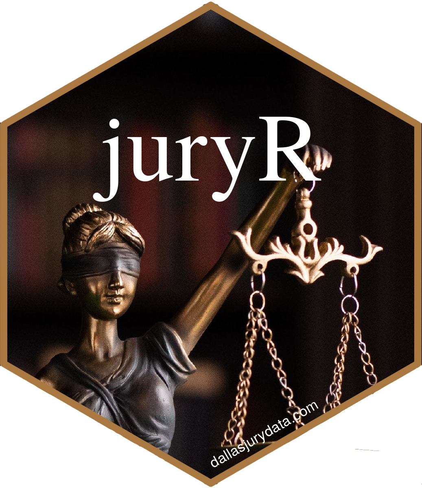

<!-- README.md is generated from README.Rmd. Please edit that file -->

# juryR 

This package is designed to accompany the paper *“Examining Bias in Jury
Selection for Criminal Trials in Dallas County”* written by Megan Ball,
Matt Farrow, [Dr. Bivin
Sadler](https://datascience.smu.edu/about/leadership-and-faculty/bivin-sadler/),
[Dr. Lynne Stokes](https://www.smu.edu/News/Experts/Lynne-Stokes),
[Judge Brandon Birmingham](https://judgebirmingham.com), and Katherine
Mitchell that was produced as the capstone project for Megan & Matt’s
[Master’s of Science in Data Science](https://datascience.smu.edu)
degree from [SMU](https://smu.edu).

## Abstract

One of the hallmarks of the American judicial system is the concept of
trial by jury, and said trial to consist of an impartial jury of your
peers. Several landmark legal cases in the history of the United States
have challenged this notion of equal representation by jury—most notably
by *Batson v. Kentucky*, 476 U.S. 79 (1986). Most of the previous
research, focus, and legal precedence has centered around peremptory
challenges and attempting to prove if bias was suspected in excluding
certain jurors from serving. Few studies, however, focus on examining
challenges for cause based on self-reported biases from the venire. This
paper evaluates if there are any relationships of interest with respect
to juror demographics and location regarding challenges for cause in
felony criminal trials in Dallas County, TX.

## Installation

<div class=".pkgdown-devel">

``` r
# Install development version from GitHub
devtools::install_github("mattfarrow1/juryr")
```

</div>

## Usage

The original dataset can be loaded using:

``` r
data(venire)
```

The dataset used in the paper which removes venirepersons who were
disqualified or exempted, and includes zip code-specific fields as well
as the juror race field with “White” as the reference race. This was
done because “White” was the most frequent race cited by potential
jurors.

``` r
data(bullpen)
```
